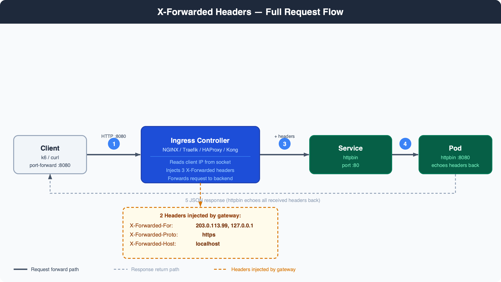
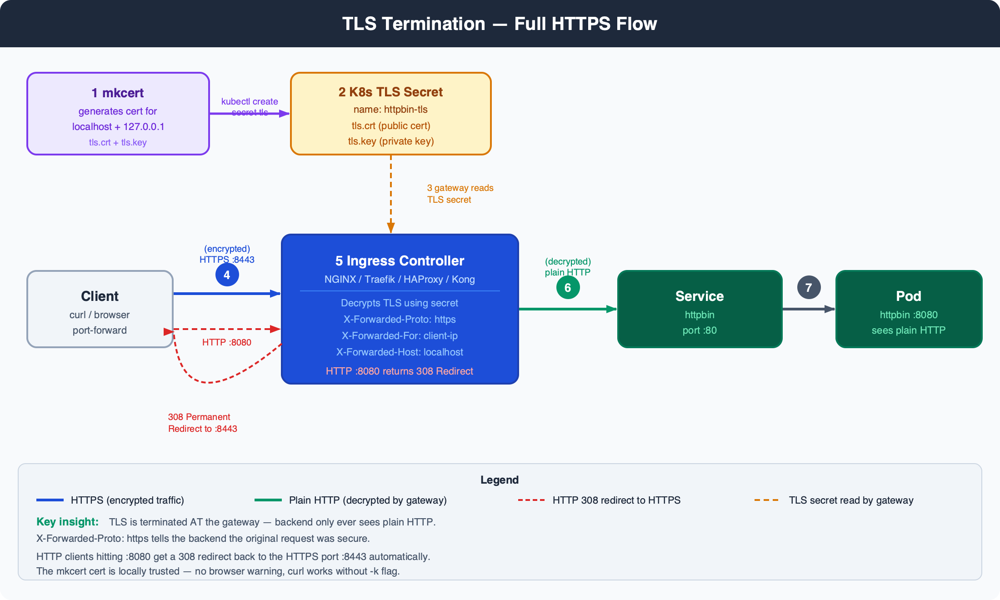
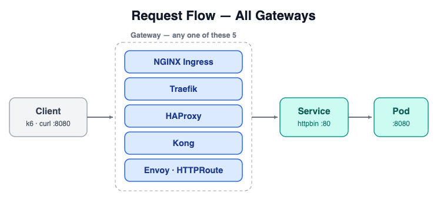
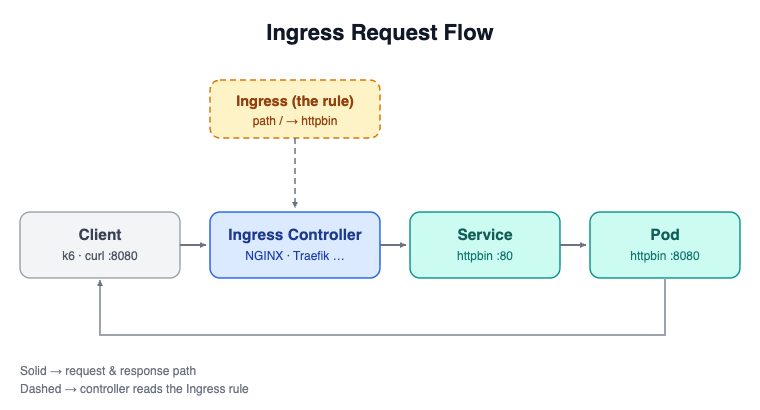

# Gateway Bake-off — Observations

Tested on: local kind cluster (single-node), macOS Apple Silicon  
Gateways tested: NGINX Ingress, Traefik  
Backend: httpbin (2 replicas)

---

## Diagrams

### X-Forwarded Headers — Full Request Flow


### TLS Termination — Full HTTPS Flow


### All Gateways — Request Flow


### Ingress Rule → Controller Flow


> Source `.drawio` files in `docs/diagrams/` — open in [app.diagrams.net](https://app.diagrams.net) to edit.

---

## 1. Load Test Results

| Rank | Gateway | Req/s | p50 | p95 | Errors |
|------|---------|-------|-----|-----|--------|
| 1 | HAProxy | 6,665 | 5.5 ms | 12.2 ms | 0% |
| 2 | Traefik | 5,923 | 6.3 ms | 13.4 ms | 0% |
| 3 | NGINX | 5,326 | 6.7 ms | 15.9 ms | 0% |
| 4 | Kong | 5,123 | 7.0 ms | 17.1 ms | 0% |
| 5 | Envoy | 4,789 | 7.2 ms | 18.4 ms | 0% |

**Winner: HAProxy** (raw speed). **Recommended: NGINX** (maturity + built-in WAF).

---

## 2. X-Forwarded Headers

| Gateway | X-Forwarded-For | X-Forwarded-Proto | X-Forwarded-Host | Config needed? |
|---------|----------------|-------------------|------------------|----------------|
| NGINX | ✅ `203.0.113.99, 127.0.0.1` | ✅ `https` | ✅ `localhost` | Yes — 2 flags needed |
| Traefik | ✅ `127.0.0.1` | ✅ `https` | ✅ `localhost` | No — works out of the box |

**NGINX** requires these flags at install time:
```
--set controller.config.use-forwarded-headers="true"
--set controller.config.compute-full-forwarded-for="true"
```
**Traefik** injects all headers automatically with zero config.

NGINX appends its own gateway IP to `X-Forwarded-For` (full hop chain). Traefik passes the direct client IP only.

---

## 3. TLS Termination (HTTPS)

| Gateway | HTTPS works | Cert used | HTTP → HTTPS redirect |
|---------|------------|-----------|----------------------|
| NGINX | ✅ HTTP/2 200 | ❌ Own self-signed cert (ignores mkcert) | ✅ 308 Redirect |
| Traefik | ✅ HTTP/2 200 | ✅ mkcert cert (locally trusted) | ✅ Auto redirect |

**Traefik** picked up the mkcert TLS secret automatically — no extra config.  
**NGINX** defaulted to its own "Fake Certificate" — needs explicit `secretName` wiring to use a custom cert.

Both return a **308 Permanent Redirect** when client hits HTTP `:8080` instead of HTTPS `:8443`.

---

## 4. Summary

| Feature | NGINX | Traefik | HAProxy | Kong | Envoy |
|---------|-------|---------|---------|------|-------|
| X-Forwarded-For | ✅ | ✅ | — | — | — |
| X-Forwarded-Proto | ✅ | ✅ | — | — | — |
| X-Forwarded-Host | ✅ | ✅ | — | — | — |
| TLS termination | ✅ | ✅ | — | — | — |
| Uses mkcert cert | ❌ | ✅ | — | — | — |
| HTTP → HTTPS redirect | ✅ | ✅ | — | — | — |

HAProxy, Kong, Envoy pending — Docker crashed during testing.
