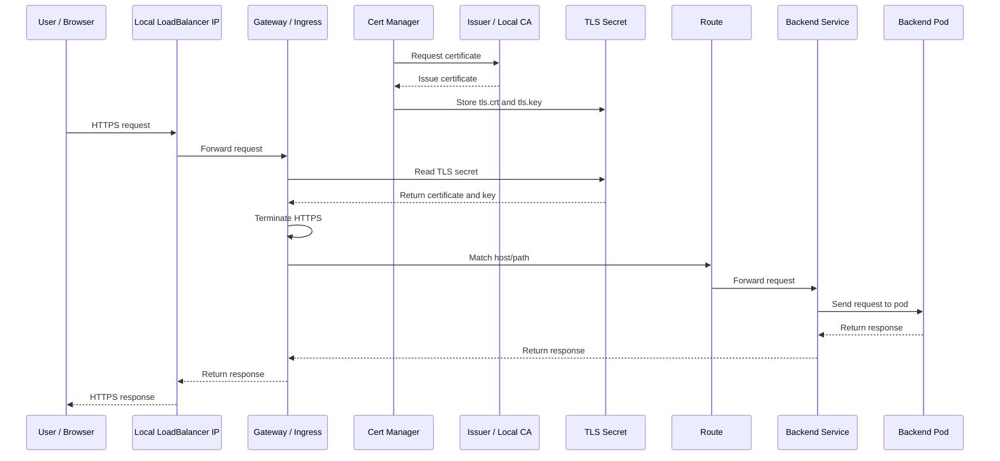
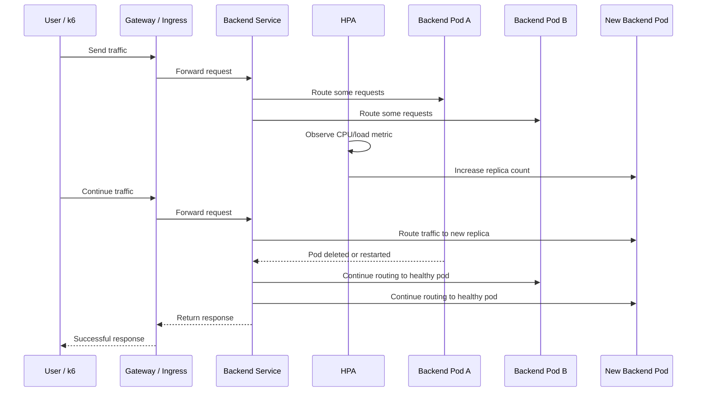

# Gateway Bake-off Next Flows

This document explains the next tasks after the completed gateway bake-off
work, based on the larger on-premise architecture flow.

## What Is Already Completed

```text
User / Browser
  -> Local LoadBalancer IP or localhost port-forward
  -> Gateway / Ingress Controller
  -> Ingress / Gateway route
  -> Backend service
  -> Backend pods
```

Completed gateway bake-off scope:

- Local Kubernetes cluster.
- Sample backend service.
- Gateway comparison:
  - NGINX Ingress
  - Traefik
  - HAProxy
  - Kong
  - Envoy Gateway
- HTTP routing.
- HTTPS/TLS termination with manually created certificate.
- X-Forwarded header verification.
- k6 load testing.
- LoadBalancer mode using MetalLB.
- Gateway access through local LoadBalancer IP.
- Result tables and request-flow diagrams.

## Where Cert Manager Fits

Current TLS flow:

```text
Manual TLS certificate
  -> Kubernetes TLS secret
  -> Gateway / Ingress HTTPS route
```

Next TLS flow:

```text
Cert Manager
  -> Issuer / local CA
  -> Certificate resource
  -> Kubernetes TLS secret
  -> Gateway / Ingress HTTPS route
```

Cert Manager does not replace the gateway. It supports the gateway by creating
and maintaining the TLS certificate used by the HTTPS route.

## Full Sequence Flow

```text
1. Cert Manager is installed in the local Kubernetes cluster.
2. Issuer or ClusterIssuer is created.
3. Certificate resource is created.
4. Cert Manager requests a certificate from the issuer.
5. Issuer creates the certificate.
6. Cert Manager stores the certificate and key in a Kubernetes TLS secret.
7. Gateway / Ingress reads that TLS secret.
8. User sends HTTPS request.
9. LoadBalancer or port-forward sends request to the gateway.
10. Gateway terminates TLS using the Cert Manager-created secret.
11. Gateway matches the route.
12. Request goes to backend service.
13. Backend service forwards to backend pod.
14. Backend pod returns response.
15. Response goes back through gateway to the user.
```

## Simple Diagram



## Next POC 1: Cert Manager

Build a local Cert Manager POC that proves:

- Cert Manager can run locally in the same Kubernetes cluster.
- Issuer or ClusterIssuer can create certificates.
- Certificate resource creates a TLS secret automatically.
- Gateway / Ingress can use that generated TLS secret.
- HTTPS request works end to end.
- Certificate status and renewal readiness can be checked.

## Next POC 2: Scaling And High Availability

The larger on-premise view also shows multiple nodes and replicas. That means
scaling and high availability can be handled as a separate next POC.

Current bake-off scaling state:

```text
Gateway / Ingress
  -> Backend service
  -> Fixed backend pods
```

Next scaling flow:

```text
Gateway / Ingress
  -> Backend service
  -> Multiple backend pods
  -> HPA or manual scale test
  -> Pod failure recovery test
```

This POC should prove:

- Backend can run with multiple replicas.
- Gateway continues routing when there are multiple backend pods.
- Kubernetes service distributes traffic to available pods.
- Manual scale-up and scale-down works.
- HPA can increase or decrease pod replicas based on load.
- If one pod is deleted, Kubernetes recreates it.
- Gateway still serves traffic during pod restart or replica changes.
- k6 can confirm traffic still works during scaling.

Simple scaling sequence:

```text
1. Deploy backend with multiple replicas.
2. Send traffic through gateway.
3. Confirm requests reach different backend pods.
4. Increase backend replicas.
5. Confirm gateway still routes traffic correctly.
6. Delete one backend pod.
7. Confirm Kubernetes recreates the pod.
8. Confirm gateway still returns successful responses.
9. Add HPA.
10. Generate load.
11. Confirm pod count increases.
12. Stop load.
13. Confirm pod count can reduce again.
```

Simple scaling diagram:



## Simple Manager Explanation

The gateway bake-off already proved routing, TLS termination, forwarded
headers, load testing, and LoadBalancer access.

The next logical task is Cert Manager because the current TLS certificate is
manual. Cert Manager automates certificate creation and stores the result as a
Kubernetes TLS secret that the gateway can use for HTTPS.

After that, Scaling and HA is the next task because the larger on-premise view
shows multiple nodes, replicas, and high availability. That POC should prove
that traffic continues to work while backend pods scale up, scale down, or
restart.
