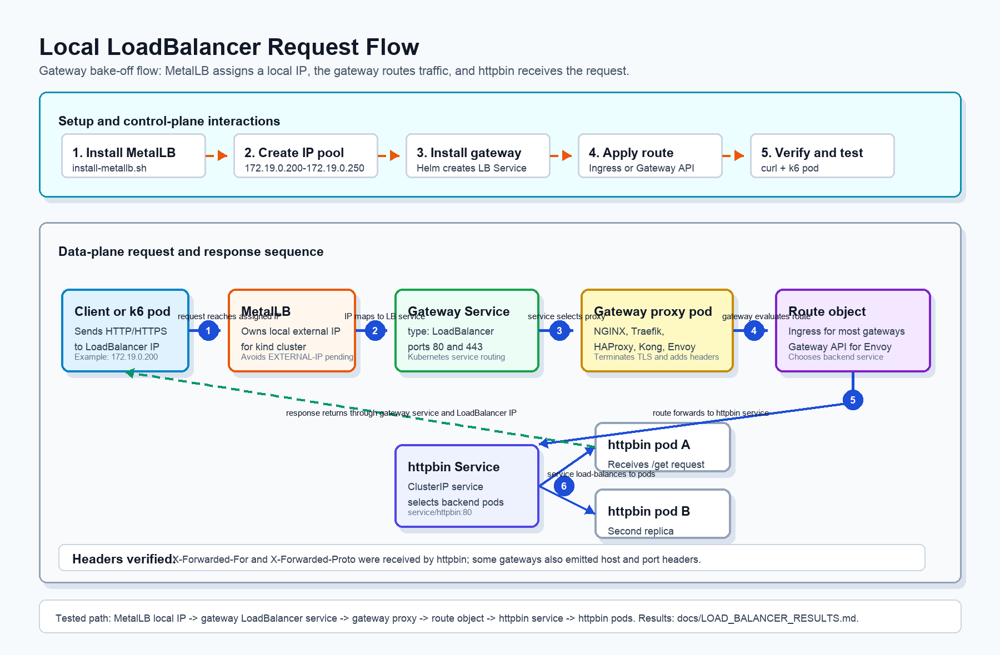

# Local LoadBalancer Mode

This project originally uses `kubectl port-forward` so every gateway can be
tested on `localhost:8080` and `localhost:8443`.

LoadBalancer mode adds a second access pattern:

```text
client
  -> local LoadBalancer IP from MetalLB
  -> gateway service
  -> ingress route
  -> httpbin backend
```

## Interaction Diagram

The sequence-style block diagram below shows how the local LoadBalancer path
works in this bake-off project:



## Why MetalLB Is Needed

In a cloud Kubernetes cluster, `service.type=LoadBalancer` asks the cloud
provider to create an external load balancer.

In a local kind cluster, there is no cloud provider. Without MetalLB, a
LoadBalancer service usually stays in `EXTERNAL-IP: <pending>`.

MetalLB allocates an IP from the local Docker `kind` network and advertises it
inside the local machine network path.

Measured LoadBalancer-only results are recorded in
[`LOAD_BALANCER_RESULTS.md`](LOAD_BALANCER_RESULTS.md).

## Setup

Create the kind cluster and deploy `httpbin` first:

```bash
kind create cluster --name bakeoff --wait 120s
kubectl apply -f manifests/httpbin.yaml
kubectl rollout status deploy/httpbin
```

Install MetalLB:

```bash
bash scripts/install-metallb.sh
```

The script:

- installs MetalLB
- waits for the controller and speaker
- detects the local Docker `kind` IPv4 network subnet
- creates a local IP address pool
- creates an L2 advertisement for that pool

## Example: NGINX With LoadBalancer

Install NGINX with a LoadBalancer service:

```bash
helm repo add ingress-nginx https://kubernetes.github.io/ingress-nginx && helm repo update

helm install nginx ingress-nginx/ingress-nginx -n ingress-nginx --create-namespace \
  --set controller.service.type=LoadBalancer \
  --set controller.admissionWebhooks.enabled=false \
  --set controller.config.use-forwarded-headers="true" \
  --set controller.config.compute-full-forwarded-for="true"

kubectl -n ingress-nginx rollout status deploy/nginx-ingress-nginx-controller --timeout=150s
kubectl -n ingress-nginx get svc nginx-ingress-nginx-controller
```

Apply the route:

```bash
sed -i '' 's/ingressClassName: .*/ingressClassName: nginx/' manifests/ingress.yaml
sed -i '' 's/ingressClassName: .*/ingressClassName: nginx/' manifests/ingress-tls.yaml
kubectl apply -f manifests/ingress.yaml
kubectl apply -f manifests/ingress-tls.yaml
```

Verify:

```bash
bash scripts/verify-loadbalancer.sh ingress-nginx nginx-ingress-nginx-controller

# Use the IP printed by the verification script.
LB_IP="172.18.0.200"
BASE="http://${LB_IP}:80" k6 run k6-test.js
```

On Docker Desktop for macOS, the MetalLB IP may not be routable directly from
the macOS host. If host-side curl cannot reach the IP, verify from inside the
cluster network instead:

```bash
kubectl run curl-lb --rm -i --restart=Never --image=curlimages/curl:8.11.1 \
  --command -- curl -m 10 -sS http://172.19.0.200/get
```

For k6 in that same network path, mount the existing script into a one-shot pod:

```bash
kubectl create configmap k6-script --from-file=k6-test.js --dry-run=client -o yaml | kubectl apply -f -

kubectl run k6-lb --restart=Never --image=grafana/k6:latest \
  --env=BASE=http://172.19.0.200:80 \
  --overrides='{"spec":{"containers":[{"name":"k6-lb","image":"grafana/k6:latest","args":["run","/scripts/k6-test.js"],"env":[{"name":"BASE","value":"http://172.19.0.200:80"}],"volumeMounts":[{"name":"script","mountPath":"/scripts"}]}],"volumes":[{"name":"script","configMap":{"name":"k6-script"}}]}}'

kubectl logs -f pod/k6-lb
```

## Example: Traefik With LoadBalancer

Install Traefik with a LoadBalancer service:

```bash
helm repo add traefik https://traefik.github.io/charts && helm repo update

helm install traefik traefik/traefik -n traefik --create-namespace \
  --set service.type=LoadBalancer

kubectl -n traefik rollout status deploy/traefik --timeout=150s
kubectl -n traefik get svc traefik
```

Apply the route:

```bash
sed -i '' 's/ingressClassName: .*/ingressClassName: traefik/' manifests/ingress.yaml
sed -i '' 's/ingressClassName: .*/ingressClassName: traefik/' manifests/ingress-tls.yaml
kubectl apply -f manifests/ingress.yaml
kubectl apply -f manifests/ingress-tls.yaml
```

Verify:

```bash
bash scripts/verify-loadbalancer.sh traefik traefik

# Use the IP printed by the verification script.
LB_IP="172.18.0.200"
BASE="http://${LB_IP}:80" k6 run k6-test.js
```

## What To Record

Record these in `scorecard.md` or `RESULTS.md` when tested:

- whether an external IP is assigned
- whether HTTP works through the LoadBalancer IP
- whether HTTPS works through the LoadBalancer IP
- whether `X-Forwarded-*` headers still reach the backend
- whether k6 results differ from the port-forward mode

## Cleanup

Uninstall the gateway before switching to another one:

```bash
kubectl delete -f manifests/ingress.yaml
kubectl delete -f manifests/ingress-tls.yaml
helm uninstall nginx -n ingress-nginx
```

MetalLB can stay installed while testing multiple gateways.

Remove everything at the end:

```bash
kind delete cluster --name bakeoff
```
